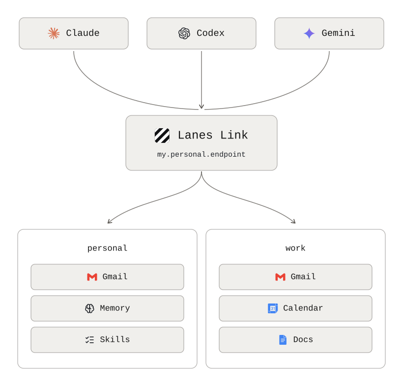

# Lanes Link

[](https://www.npmjs.com/package/@lanes-sh/link)
[](LICENSE)
[](https://github.com/lanes-sh/link/actions/workflows/ci.yml)

**One secure endpoint between your AI agents and all your connections, memory, skills, and secrets.**

Connect your mail, calendar, files, and notes once, and add the memory and skills that only you
have. Every agent you use — Claude, ChatGPT, and anything else that speaks MCP — reaches them
through a single MCP endpoint that you own and run. Open source, self-hostable, no vendor sitting in
the middle of your data.

<picture>
  <source media="(prefers-color-scheme: dark)" srcset="docs/images/lanes-link-dark.svg">
  
</picture>

## Why

- **Connect once, use everywhere.** No per-agent integrations, no re-authorising every new tool.
- **You decide what agents can touch.** Permissions default to deny, and the runtime enforces
  them — it does not ask the model to behave.
- **Work and personal never mix.** Separate profiles, separate credentials, separate stores.
- **Every call is recorded.** An append-only log of what was reached, and what was refused.

## What people use it for

- **A personal assistant on your phone.** A deployment is a URL, so the claude.ai or ChatGPT app
  reaches your mail, calendar, and files from anywhere — "what's on tomorrow", "reply to Ana's
  thread", "find the invoice from March". This is the case that needs [your own
  cloud](#run-it-anywhere); everything below works on your machine.
- **Inbox triage you sign off on.** An agent searches, reads, labels, and composes — and saves a
  draft for you to send rather than sending it, until you decide otherwise.
- **Coding agents that start from your context.** Claude Code and Codex reach the same Linear
  issues, Notion pages, and notes you do, so a session begins from what you already know instead
  of an empty prompt.
- **One set of notes behind every agent.** What you have Claude Code write down, claude.ai reads
  back later — your accumulated context follows you between tools instead of being trapped in
  whichever one recorded it.
- **Your own procedures, followed rather than guessed.** How a standup update reads, where an
  invoice gets filed, who gets cc'd on a contract — written down once, and every agent you use
  follows the same one.

## Quickstart

Needs [Bun](https://bun.com) 1.3.11+. Nothing else — no account anywhere.

```console
$ bun install -g @lanes-sh/link                # puts `lanes` on your PATH
$ lanes link profile add personal --target local
$ lanes link start --profile personal --target local
ok    serving http://127.0.0.1:7337/mcp
      profiles: personal
```

Then, in another shell:

```console
$ lanes link mcp add --profile personal --target local                           # every agent installed; or name one: claude, codex
ok    registered lanes-link with Claude Code (user scope)
ok    registered lanes-link with Codex
```

Your agents can now use it. Memory, skills, and the vault hold your own material rather than an
account, so switching them on costs nothing — one command each, no credentials, no browser. Mail and
calendar are the next step. **[Full quickstart →](docs/quickstart.md)**

## What your agent gets

| | | Manage it with |
|---|---|---|
| **Connections** | your external accounts — mail, calendar, files, issues | `lanes link connect` |
| **Memory** | what you want remembered between sessions | `lanes link memory` |
| **Skills** | your own procedures, handed to an agent as instructions | `lanes link skills` |
| **Vault** | passwords and API keys, released only where you allow it | `lanes link vault` |

Memory and skills are plain Markdown files, so a text editor and an agent reach the same bytes. All
four belong to one profile: what you add under `work` is invisible under `personal`.

## Connect an account

One command per account. Run it again to add a second mailbox, a second calendar, a second anything.

| | Connect with |
|---|---|
| Gmail | `lanes link connect gmail` |
| Google Drive | `lanes link connect drive` |
| Google Sheets | `lanes link connect sheets` |
| Google Docs | `lanes link connect docs` |
| Google Calendar | `lanes link connect calendar` |
| Google Tasks | `lanes link connect tasks` |
| Google Contacts | `lanes link connect contacts` |
| iCloud Mail | `lanes link connect icloud_mail` |
| iCloud Calendar | `lanes link connect icloud_calendar` |
| iCloud Contacts | `lanes link connect icloud_contacts` |
| iCloud Drive | `lanes link connect icloud_drive` |
| Notion | `lanes link connect notion` |
| Linear | `lanes link connect linear` |
| GitHub | `lanes link connect github` |
| Slack | `lanes link connect slack` |
| Gmail (Google MCP) | `lanes link connect gmail_mcp` |
| Drive (Google MCP) | `lanes link connect drive_mcp` |

Three things worth knowing up front. `lanes link connect icloud` sets up Mail, Calendar, and
Contacts together, because one app-specific password covers all three. Google needs no OAuth client
of your own: `lanes link connect gmail` authorises against the one Lanes operates, so there is no
Cloud console to visit — add `--own-client` if you would rather register your own. And GitHub and
Slack take a token you paste rather than a browser sign-in, because neither will register a client
for us; for Slack that means creating a Slack app once, which is the one console visit left here.

Full guide — what each one gives your agent, what it needs, and adding your own:
**[docs/connect.md](docs/connect.md)**.

## Run it anywhere

The same code, the same config, in all three. Only the storage adapters change.

| | **Local** | **Your own cloud** | **Lanes Cloud** |
|---|---|---|---|
| Runs on | your machine | your GCP project, on Cloud Run | managed for you |
| Needs | Bun, nothing else | a Google Cloud billing account | — |
| Set up with | `lanes link start` | `lanes link deploy` | [join the waitlist](https://lanes.sh/forms/f/a46d8b45-4759-485b-841c-d117a823b645) |
| Reachable from | that machine | anywhere, including your phone | anywhere |
| Status | ready | ready | **coming soon** |

**Local** is the fastest way to start, and where most people stay. **Your own cloud** is what you
want if you need to reach it from claude.ai, ChatGPT, or a phone — `lanes link deploy` creates the
project, the bucket, the service account, and the revision on its first run. **Lanes Cloud** is the
managed version; because it is the same data model, a workspace you build today moves across rather
than being rebuilt.
[Join the waitlist](https://lanes.sh/forms/f/a46d8b45-4759-485b-841c-d117a823b645) to hear when it opens.

## Docs

- **[Quickstart](docs/quickstart.md)** — from nothing to a working endpoint
- **[Connect your accounts](docs/connect.md)** — every provider, and what each one needs
- **[Add it to your agent](docs/clients.md)** — Claude Code, Codex, Claude Desktop, claude.ai, ChatGPT
- **[Deploy to your own cloud](docs/deploy.md)** — five commands to a URL
- **[Full reference](docs/detailed/)** — architecture, configuration, the CLI, the security model,
  writing a provider, and the decision records

## Security

Lanes Link holds live credentials to your email and documents. The
[security model](docs/detailed/security.md) states its limits plainly rather than implying
guarantees the code does not deliver — read it before you trust it with an account. To report a
vulnerability, see [`SECURITY.md`](SECURITY.md); please do not open a public issue.

## License

[Apache-2.0](LICENSE)
